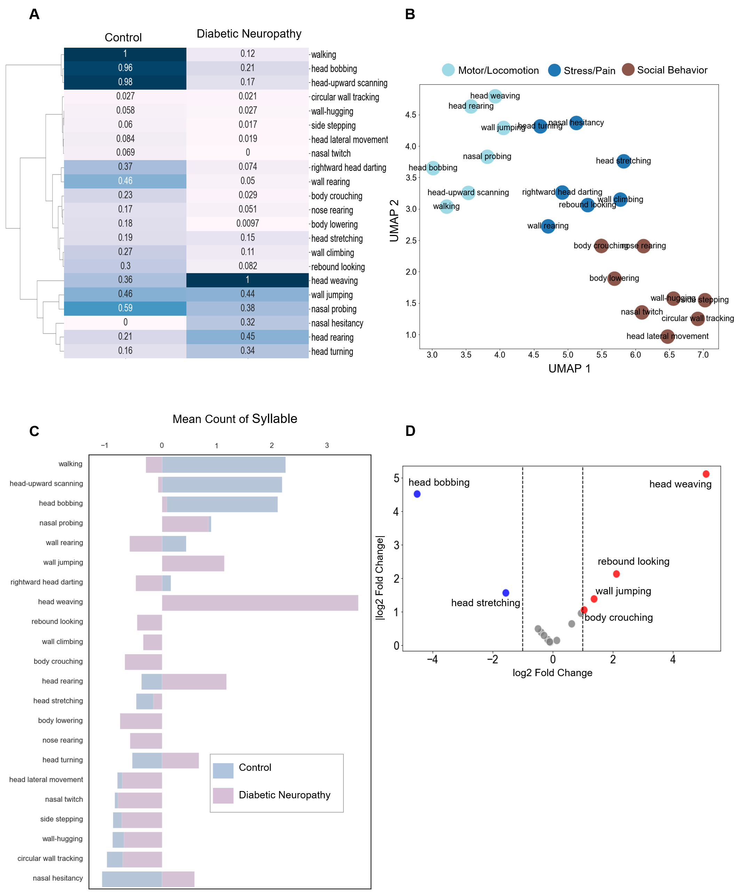

# **MoSeq-based 3D Behavioral Profiling Analysis**
## **Supporting codebase and data for the publication titiled "MoSeq Based 3D Behavioral Profiling Uncovers Neuropathic Behavior Changes in Diabetic Mouse Model"**
## `Ashiquzzaman et al. (2025)` [accepted]
## UPDATE: Cite `Cite this article : Ashiquzzaman, A., Lee, E., Znaub, B.F. et al. MoSeq based 3D behavioral profiling uncovers neuropathic behavior changes in diabetic mouse model. Sci Rep 15, 15114 (2025). https://doi.org/10.1038/s41598-025-98184-9`

## 📌 Publication Status

This analysis was **accepted for publication in Scientific Reports** on **Received 04 December 2024 Accepted 09 April 2025 Published 29 April 2025**, under the title:

**"MoSeq Based 3D Behavioral Profiling Uncovers Neuropathic Behavior Changes in Diabetic Mouse Model"**

## 🧠 Main Figure: Behavioral Syllable Clustering



**Figure: Behavioral Syllable Dynamics in Diabetic Neuropathy Mice.**  
(A) Heatmap showing normalized syllable usage between behavioral syllables for control (left) and diabetic neuropathy (right) groups. The color intensity reflects syllable frequency, with diabetic neuropathy mice exhibiting distinct patterns. Notable syllables such as walking and head weaving demonstrate significant differences between groups. Hierarchical clustering dendrogram of behavioral syllables reveals distinct grouping dynamics. Clusters highlight exploratory behaviors (e.g., "head weaving," "wall jumping") and posture-associated behaviors (e.g., "body crouching," "nose rearing") that differ significantly between groups, along with UMAP projection of syllable distributions.  
(B) Same UMAP projection of syllable distributions with k-means clustering (n=3) identifies three distinct clusters. Behaviors such as "wall jumping" and "head bobbing" are uniquely clustered in diabetic neuropathy mice, highlighting altered behavioral patterns.  
(C) Bar plots comparing behavioral features indicate significant increases in "head weaving" and "wall jumping" in diabetic neuropathy mice, alongside reductions in "head stretching" and "body crouching".  
(D) The volcano plot highlights significant behavioral changes in diabetic neuropathy mice, with increased "head weaving" (log₂ fold change ≈ +5) and "wall jumping" (log₂ fold change ≈ +1.5), while behaviors like "head bobbing" (log₂ fold change ≈ -4.8) and "head stretching" (log₂ fold change ≈ -1.6) are reduced compared to controls. Red and blue dots indicate upregulated and downregulated behaviors, respectively, while gray dots denote behaviors with no significant change.


## **Overview**
This repository contains two main Python scripts used in the paper:

1. **`feature_processing.py`**  
   - Preprocesses MoSeq feature data, normalizes values, and performs PCA to explore differences in behavior profiles.  
   - Computes statistical comparisons and correlation with von Frey test results.  
   - Produces three **Nature-style figures**:  
     - **PCA scatter plot** to visualize group differences.  
     - **Correlation heatmap** to reveal feature-feature relationships.  
     - **Volcano plot** to highlight significantly altered behavioral features in **Diabetic Neuropathy (DN) vs. Control.**  

2. **`behavior_regulation.py`**  
   - Analyzes **MoSeq behavioral syllables**, focusing on frequency distributions and regulation changes.  
   - Performs **hierarchical clustering, UMAP dimensionality reduction, and KMeans clustering** to identify behavior patterns.  
   - Generates **volcano plots, heatmaps, and bar charts** to visualize behavioral shifts.  

This **novel MoSeq analysis framework** can be used to explore high-dimensional behavioral data in rodent models of **neurological disorders.**

---

## **1️⃣ feature_processing.py: PCA and Feature Analysis**
### **Functionality**
- Loads and **merges** MoSeq behavior features (`velocity`, `length`, `pose`, `position`) with von Frey test results.  
- **Normalizes** all features using **StandardScaler** to ensure comparability.  
- Performs **Principal Component Analysis (PCA)** to visualize group-level differences.  
- Computes **feature correlations** with von Frey test values.  
- Conducts **t-tests** to identify significant behavioral feature differences between **Diabetic Neuropathy (DN) and Control** groups.  
- Generates three key **figures** for scientific publication.

---

### **Key Steps**
#### **1. Data Loading & Merging**
- Reads **MoSeq feature files**:  
  - `Velocity-Moseq-data.csv`
  - `length-Moseq-data.csv`
  - `MoSeq_pose.csv`
  - `psition-Moseq.csv`
- Reads **von Frey data** (`vf-data.csv`) and merges with MoSeq features.  
- Creates a **"group" column** to distinguish **Control (0) vs. DN (1)**.

#### **2. Feature Normalization**
- Identifies all MoSeq behavioral features.  
- Uses **`StandardScaler()`** to normalize values across all features.  

#### **3. PCA Analysis & Visualization**
- **Performs PCA** to reduce feature space to **two principal components**.
- **Scatter plot**: Displays PCA results, with groups **colored for separation.**  

#### **4. Feature Correlations with von Frey**
- Computes **Pearson correlations** between MoSeq features and von Frey results.
- Generates a **correlation heatmap** of all features.

#### **5. Group-wise Comparisons (DN vs. Control)**
- Runs **t-tests** comparing **DN vs. Control** for each MoSeq feature.
- Generates a **volcano plot**:
  - X-axis: **Effect size (DN - Control)**
  - Y-axis: **Significance (-log10(p-value))**
  - **Highlights significantly altered behaviors.**

---

### **Generated Figures**
| **Figure** | **Description** |
|------------|----------------|
| **Figure 1** | **PCA scatter plot** showing behavioral separation between Control and DN. |
| **Figure 2** | **Correlation heatmap** of MoSeq features to visualize inter-feature relationships. |
| **Figure 3** | **Volcano plot** of significantly altered behavioral features in DN. |

---

## **2️⃣ behavior_regulation.py: Behavioral Clustering & Regulation Analysis**
### **Functionality**
- Processes **MoSeq syllable usage patterns**.
- **Clusters** behaviors via **hierarchical clustering, UMAP, and KMeans.**  
- **Compares** Control vs. DN **behavioral syllable distributions**.  
- **Identifies** significantly **upregulated/downregulated** behaviors.  
- **Generates multiple scientific figures**:  
  - **Heatmaps**
  - **UMAP embeddings**
  - **Volcano plots**
  - **Bar charts**

---

## **📂 File Structure**
```
/MoSeq_Behavior_Analysis
│── feature_processing.py       # PCA, t-tests, correlation analysis
│── behavior_regulation.py      # Clustering, UMAP, behavior regulation analysis
│── data/
│   ├── vf-data.csv             # Von Frey results
│   ├── Velocity-Moseq-data.csv # MoSeq feature data
│   ├── length-Moseq-data.csv   # MoSeq feature data
│   ├── MoSeq_pose.csv          # MoSeq feature data
│   ├── psition-Moseq.csv       # MoSeq feature data
│   ├── behavior_map_dn.csv     # MoSeq syllable mapping
│   ├── Control_syllable_counts.csv  # MoSeq syllable usage (Control)
│   ├── Diabetic_Neuropathy_syllable_counts.csv  # MoSeq syllable usage (DN)
│── figures/
│   ├── PCA_plot.png
│   ├── Heatmap.png
│   ├── Volcano_Plot.png
│   ├── UMAP_Plot.png
│   ├── Behavior_Frequencies.png
│── README.md                   # This document
```

---

## **🔧 Dependencies**
- Python 3.x
- NumPy, Pandas
- Matplotlib, Seaborn
- Scipy, Scikit-learn
- UMAP, KMeans (for behavior clustering)

To install all dependencies:
```bash
pip install numpy pandas matplotlib seaborn scipy scikit-learn umap-learn
```

---

## **📜 Citation**
If using this analysis, please cite:
> **Ashiquzzaman, A., Lee, E., Znaub, B.F. et al. MoSeq based 3D behavioral profiling uncovers neuropathic behavior changes in diabetic mouse model. Sci Rep 15, 15114 (2025). https://doi.org/10.1038/s41598-025-98184-9**

---

This README provides **reviewers** with **clear documentation** on how your **MoSeq-based behavioral analysis** is implemented, making it easier to evaluate and reproduce.

Let me know if you need further refinements! 🚀

